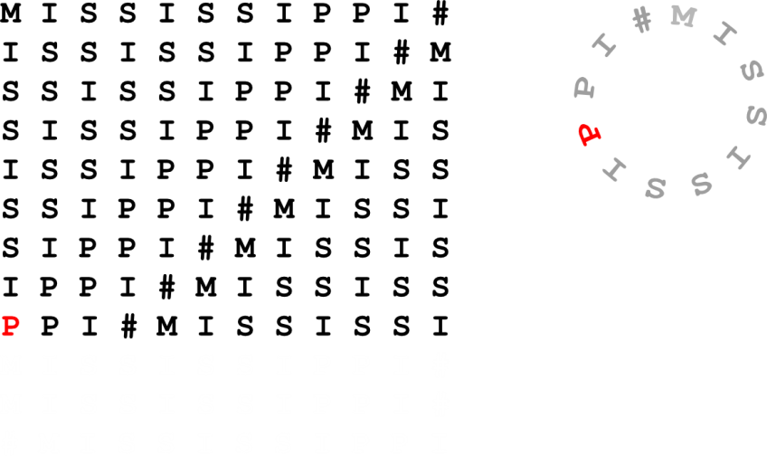
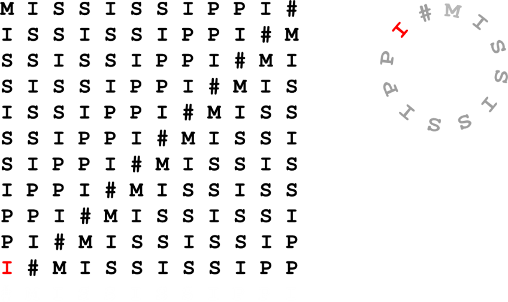
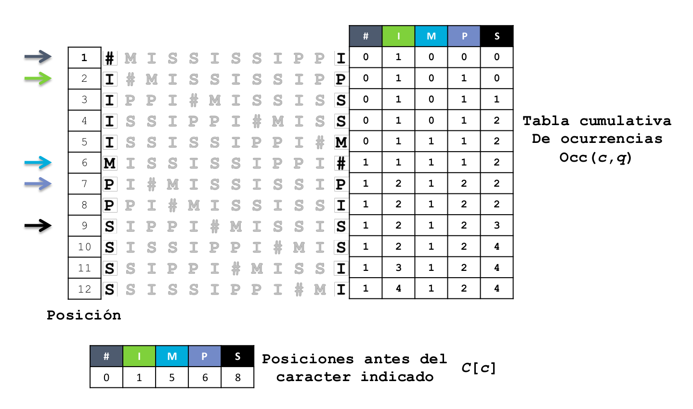
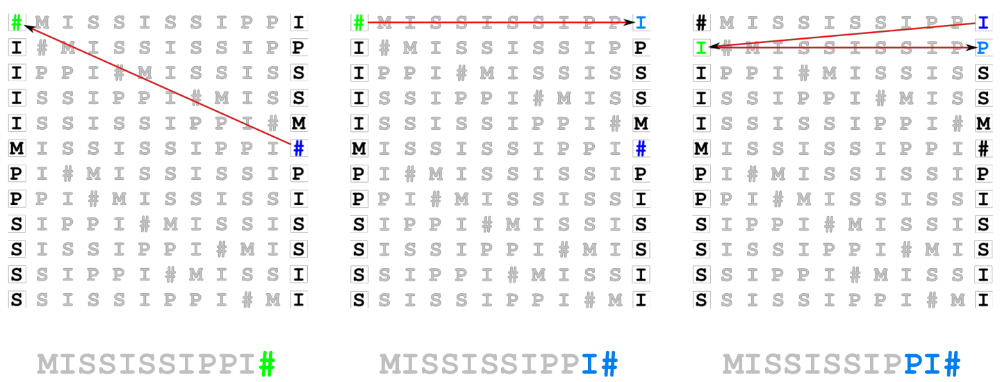

*Before we start*
-----------------

La sesión del día de hoy implica correr un par de comandos que tomarán algo de tiempo, en consecuencia, los correremos al inicio de la sesión y explicaremos su sintaxis y funcionamiento a lo largo de la sesión.

.. important::

	En los ambientes unix linux los programas no se instalan de la misma forma que en los ambientes windows o mac, en vez tenemos que descargar el código fuente de los programas, compilarlo cuando así sea necesario e instalarlo en algun lugar de nuestro sistema

	Los siguientes comandos nos permitirán instalar bwa en nuestro sistema::

		$ pwd
		/home/vflorelo

		$ git clone https://github.com/lh3/bwa.git

		$ls
		bwa dia_01 dia_02 dia_03

		$ mkdir bin

		$ cd bwa

		$ make

		$ mv bwa /home/vflorelo/bin

		$ bwa index

.. admonition:: Comandos del día

	Recuerda copiar unicamente los comandos en las líneas marcadas con el signo '$'

	.. code-block:: sh

		$ ls
		/home/vflorelo

		$ ls
		dia_01
		dia_02
		dia_03

		$ cd dia_02

		$ ls -lh

		total 648M
		-rwxrwxr-x 1 vflorelo bioinformatics  81M Sep 22 06:19 NA12878-TS1Exp-TiVAL3-rep5_S20_L001_R1_001.fastq.gz
		-rwxrwxr-x 1 vflorelo bioinformatics  82M Sep 22 06:19 NA12878-TS1Exp-TiVAL3-rep5_S20_L001_R2_001.fastq.gz
		-rwxrwxr-x 1 vflorelo bioinformatics  80M Sep 22 06:19 NA12878-TS1Exp-TiVAL3-rep5_S20_L002_R1_001.fastq.gz
		-rwxrwxr-x 1 vflorelo bioinformatics  81M Sep 22 06:19 NA12878-TS1Exp-TiVAL3-rep5_S20_L002_R2_001.fastq.gz
		-rwxrwxr-x 1 vflorelo bioinformatics  81M Sep 22 06:19 NA12878-TS1Exp-TiVAL3-rep5_S20_L003_R1_001.fastq.gz
		-rwxrwxr-x 1 vflorelo bioinformatics  82M Sep 22 06:19 NA12878-TS1Exp-TiVAL3-rep5_S20_L003_R2_001.fastq.gz
		-rwxrwxr-x 1 vflorelo bioinformatics  80M Sep 22 06:19 NA12878-TS1Exp-TiVAL3-rep5_S20_L004_R1_001.fastq.gz
		-rwxrwxr-x 1 vflorelo bioinformatics  82M Sep 22 06:19 NA12878-TS1Exp-TiVAL3-rep5_S20_L004_R2_001.fastq.gz

		$ cat \*R1_001.fastq.gz > ../dia_03/forward_reads.fastq.gz

		$ cat \*R2_001.fastq.gz > ../dia_03/reverse_reads.fastq.gz

		$ cd ../dia_03

		$ bwa mem -M -t 4 /usr/local/bioinformatics/databases/genome/Homo_sapiens_GRCh38.fasta forward_reads.fastq.gz reverse_reads.fastq.gz > S1.sam &

.. warning::

	Es importante que antes de dar enter al último comando nos muestren sus pantallas para que podamos seguir, este último comando generará un archivo de ~15 Gb en ~1 h

Introducción
------------
Ya tenemos nuestras secuencias en formato fastq y salieron bien de calidad. Qué hago con las secuencias para el llamado de variantes?

El siguiente paso es alinear dichas lecturas sobre un genoma de referencia que nos permita detectar variaciones **con respecto de ese genoma**

.. important::

	En llamado de variantes es de suma importancia especificar cual fue la referencia que se empleó

	La secuencia de referencia del genoma humano no es la misma en 2020 que la que se liberó en Mayo de 2000, en total ha sufrido 19 revisiones para un total de 20 versiones.

.. note::

	'The human reference genome GRCh38 was released from the Genome Reference Consortium on 17 December 2013. This build contained around 250 gaps, whereas the first version had roughly 150,000 gaps'

.. important::

	En este taller emplearemos la versión GRCh38 (hg38) del genoma humano.

Alineamiento de lecturas sobre un genoma
----------------------------------------

Existen cientos de estrategias con las que se pueden alinear secuencias sobre un genoma de referencia, no obstante muchas de ellas son imprácticas cuando se trata de datos voluminosos

En esta sesión veremos una de las estrategias más ampliamente utilizadas en bioinformática (no solamente en llamado de variantes): Alineamiento basado en la transformada de Burrows-Wheeler

Este procedimiento consta de dos etapas

1. Construcción de la transformada de Burrows-Wheeler de nuestra secuencia genómica
2. Busqueda de las posiciones de las lecturas sobre la secuencia genómica mediante backtracking

Transformada de Burrows-Wheeler
-------------------------------

.. note::

	La transformada de Burrows-Wheeler (BWT por sus siglas en inglés) tiene aplicaciones en múltiples áreas, es el fundamento de algoritmos de compresión como el protocolo gz

	La BWT consta de 4 pasos esenciales

	1. Construcción de una matriz de permutaciones
	2. Ordenamiento lexicográfico de la matriz
	3. Extracción de los campos informativos
	4. Compresión de los datos para su manejo

Comencemos con un ejemplo *sencillo* (*ish*): tomemos la palabra :code:`MISSISSIPPI`

.. |bwt_01| image:: bwt_01.png
	:width: 150 px
	:alt: command
.. |bwt_02| image:: bwt_02.png
	:width: 150 px
	:alt: command
.. |bwt_03| image:: bwt_03.png
	:width: 150 px
	:alt: command
.. |bwt_04| image:: bwt_04.png
	:width: 150 px
	:alt: command
.. |bwt_05| image:: bwt_05.png
	:width: 150 px
	:alt: command
.. |bwt_06| image:: bwt_06.png
	:width: 150 px
	:alt: command

.. |bwt_08| image:: bwt_08.png
	:width: 150 px
	:alt: command

.. |bwt_10| image:: bwt_10.png
	:width: 150 px
	:alt: command

.. |bwt_12| image:: bwt_12.png
	:width: 150 px
	:alt: command

.. admonition:: Construcción de una matriz de permutaciones

	+----------+----------+----------+----------+
	+ |bwt_01| + |bwt_02| + |bwt_03| + |bwt_04| +
	+----------+----------+----------+----------+
	+ |bwt_05| + |bwt_06| + |bwt_07| + |bwt_08| +
	+----------+----------+----------+----------+
	+ |bwt_09| + |bwt_10| + |bwt_11| + |bwt_12| +
	+----------+----------+----------+----------+

.. admonition:: Ordenamiento lexicográfico de la matriz y obtención de los campos informativos

	.. image:: bwt_13.png
		:width: 600 px

.. admonition:: Compresión de los datos

	:code:`MISSISSIPPI -> IPSSM#PISSII -> IP2SM#PI2S2I`

.. important::

	Este mismo procedimiento se aplica sobre la secuencia genómica a emplear, en el caso del genoma humano estaremos comprimiendo 25 palabras que suman >3,000,000,000 caracteres

*Tries* y búsqueda por *backtracking*
-------------------------------------

.. |backtrack_06| image:: backtrack_06.png
	:width: 150 px
	:alt: backtrack_06

.. |mississippi_02| image:: mississippi_02.png
	:width: 150 px
	:alt: mississippi_02
.. |mississippi_03| image:: mississippi_03.png
	:width: 150 px
	:alt: mississippi_03

.. |search_02| image:: search_02.png
	:width: 200 px
	:alt: search_02

.. admonition:: Backtracking

	Una vez que construimos nuestra BWT, podemos buscar palabras sobre dicha BWT, para ello usamos una estrategia de *backtracking*

	+----------------+----------------+----------------+
	+ |backtrack_01| + |backtrack_04| + |backtrack_06| +
	+----------------+----------------+----------------+

.. admonition:: Busquemos la palabra inicial

	+------------------+------------------+------------------+
	+ |mississippi_01| + |mississippi_02| + |mississippi_03| +
	+------------------+------------------+------------------+

.. admonition:: Ahora busquemos sólo la palabra MISS

	+-------------+-------------+
	+ |search_01| + |search_02| +
	+-------------+-------------+

.. warning::

	Cómo podemos optimizar estas búsquedas?

	Para completar la estrategia de búsqueda los programas de mapeo de lecturas usan una estructura de datos llamada árbol de sufijos (*suffix tree*). Los árboles de sufijos son un tipo especial de *otra* estructura de datos llamada *trie* (del inglés **retrieval**).

	.. image:: trie.png
		:width: 600 px

.. important::

	Esto ocurre en nuestro programa miles de millones de veces de forma paralela! Esta combinación de algoritmos revolucionó el alineamiento de lecturas cortas

Formatos de salida: SAM
-----------------------

Una vez que concluye el proceso de mapeo de lecturas, los programas usualmente entregan un archivo en formato SAM (*sequence alignment and mapping*)

Este formato es un estándar en bioinformática y la descripción completa del formato, podemos revisar la `documentación oficial`_

.. important::

	Para fines de este curso, conoceremos la estructura mínima necesaria de dicho formato:

	+-------+-------------------------------------------------+
	+ Campo + Descripción                                     +
	+=======+=================================================+
	+  1    + Nombre de la lectura                            +
	+-------+-------------------------------------------------+
	+  2    + FLAG                                            +
	+-------+-------------------------------------------------+
	+  3    + Nombre de la secuencia de referencia (genoma)   +
	+-------+-------------------------------------------------+
	+  4    + Posición de la lectura en dicho genoma          +
	+-------+-------------------------------------------------+
	+  5    + Calidad del mapeo                               +
	+-------+-------------------------------------------------+
	+  6    + CIGAR                                           +
	+-------+-------------------------------------------------+
	+  7    + Nombre de la lectura complementaria (su *mate*) +
	+-------+-------------------------------------------------+
	+  8    + Posición de la lectura complementaria           +
	+-------+-------------------------------------------------+
	+  9    + Longitud del segmento cubierto por el par       +
	+-------+-------------------------------------------------+
	+ 10    + Secuencia de la lectura                         +
	+-------+-------------------------------------------------+
	+ 11    + Calidad de la lectura (ASCII)                   +
	+-------+-------------------------------------------------+

.. important::

	Ejemplo de un archivo SAM::

		@SQ	SN:1	LN:248956422
		@SQ	SN:2	LN:242193529
		@SQ	SN:3	LN:198295559
		@SQ	SN:4	LN:190214555
		@SQ	SN:5	LN:181538259
		@SQ	SN:6	LN:170805979
		@SQ	SN:7	LN:159345973
		@SQ	SN:8	LN:145138636
		@SQ	SN:9	LN:138394717
		@SQ	SN:10	LN:133797422
		@SQ	SN:11	LN:135086622
		@SQ	SN:12	LN:133275309
		@SQ	SN:13	LN:114364328
		@SQ	SN:14	LN:107043718
		@SQ	SN:15	LN:101991189
		@SQ	SN:16	LN:90338345
		@SQ	SN:17	LN:83257441
		@SQ	SN:18	LN:80373285
		@SQ	SN:19	LN:58617616
		@SQ	SN:20	LN:64444167
		@SQ	SN:21	LN:46709983
		@SQ	SN:22	LN:50818468
		@SQ	SN:X	LN:156040895
		@SQ	SN:Y	LN:57227415
		@SQ	SN:MT	LN:16569
		@RG	ID:test_data	LB:test_data	PL:Illumina	SM:test_data	PU:test_data
		@PG	ID:bwa	PN:bwa	VN:0.7.17-r1194-dirty	CL:bwa mem -M -t 4 /usr/local/bioinformatics/databases/Genome/Homo_sapiens_GRCh38.fasta forward_reads.fastq.gz reverse_reads.fastq.gz
		NB502037:60:HV7GWBGXC:1:11107:22080:13075	163	1	12028	0	74M	=	12153	199	CTGCTGGCCTGTGCCAGGGTGCAAGCTGAGCACTGGAGTGGAGTTTTCCTGTGGAGAGGAGCCATGCCTAGAGT	BGJHIJHHHFKDJH/GIHHE5HG2IH6JFIHHHFJHFIDJHFIDGDGG/FJDKHFIFIHCIIGGEJH/FCIFI3	MC:Z:74M	MD:Z:74	PG:Z:MarkDuplicates	RG:Z:NGS023	NM:i:0	AS:i:74	XS:i:74
		NB502037:60:HV7GWBGXC:1:21103:3654:10675	163	1	12028	0	74M	=	12257	303	CTGCTGGCCTGTGCCAGGGTGCAAGCTGAGCACTGGAGTGGAGTTTTCCTGTGGAGAGGAGCCATGCCTAGAGT	BGJHIJHHHFKDJHDGIHHEJHGFIHFJ.IHACFJHFIDJHFI5GGGG/FJDKHFIFIHGIFGGEJ6G7CIFIB	MC:Z:74M	MD:Z:74	PG:Z:MarkDuplicates	RG:Z:NGS023	NM:i:0	AS:i:74	XS:i:74
		NB502037:60:HV7GWBGXC:1:21310:18749:17844	99	1	12028	0	74M	=	12289	333	CTGCTGGCCTGTGCCAGGGTGCAAGCTGAGCACTGGAGTGGAGTTTTCCTGTGGAGAGGAGCCATGCCTAGAGT	AFIFHJHGFFKDJHGHIIHEJHGFIHGJ/JHGHGJGFIDKHGIEGGHGHFKDKHFIFIHFJFGHEKHGFDIFIC	MC:Z:72M2S	MD:Z:74	PG:Z:MarkDuplicates	RG:Z:NGS023	NM:i:0	AS:i:74	XS:i:74
		NB502037:60:HV7GWBGXC:1:23202:12800:17985	163	1	12028	0	74M	=	12199	244	CTGCTGGCCTGTGCCAGGGTGCAAGCTGAGCACTGGAGTGGAGTTTTCCTGTGGAGAGGAGCCATGCCTAGAGT	BGJHIJHHHFKDJHGGIHHEJHGFIHFJFIHHHFJHFIDJHFIDGDGGHFJDKHFIF5HGIIGCEJHG7CIFIC	MC:Z:73M	MD:Z:74	PG:Z:MarkDuplicates	RG:Z:NGS023	NM:i:0	AS:i:74	XS:i:74
		NB502037:60:HV7GWBGXC:2:11205:4868:3501	163	1	12028	0	74M	=	12224	269	CTGCTGGCCTGTGCCAGGGTGCAAGCTGAGCACTGGAGTGGAGTTTTCCTGTGGAGAGGAGCCATGCCTAGAGT	BGJHIJ7HHFKDJHGAIH2EJHGFIHEJFIHHHFJHFIDJHFI@GGGGHFJDKHFIFIHGIIGGEJFGFBIFI/	MC:Z:73M	MD:Z:74	PG:Z:MarkDuplicates	RG:Z:NGS023	NM:i:0	AS:i:74	XS:i:74
		NB502037:60:HV7GWBGXC:2:12201:8069:10334	99	1	12028	0	74M	=	12262	308	CTGCTGGCCTGTGCCAGGGTGCAAGCTGAGCACTGGAGTGGAGTTTTCCTGTGGAGAGGAGCCATGCCTAGAGT	AFIFHJHDFFGDJ12BI5HEJHGFIHGJ/JHGDGJ3/CDKHGCEGECGDE>26H/IFIHFJHGHEKHG7DIFIC	MC:Z:74M	MD:Z:74	PG:Z:MarkDuplicates	RG:Z:NGS023	NM:i:0	AS:i:74	XS:i:74
		NB502037:60:HV7GWBGXC:2:13110:9149:6398	163	1	12028	0	74M	=	12202	248	CTGCTGGCCTGTGCCAGGGTGCAAGCTGAGCACTGGAGTGGAGTTTTCCTGTGGAGAGGAGCCATGCCTAGAGT	BGJHIJHHHFKDJHGGIHHEJHGFIHFJFIHHHFJHFIDJHFIDGGGGHFJDKHFIFIHGIIGGEJHGFCIFIC	MC:Z:74M	MD:Z:74	PG:Z:MarkDuplicates	RG:Z:NGS023	NM:i:0	AS:i:74	XS:i:74
		NB502037:60:HV7GWBGXC:3:13403:15882:14640	163	1	12028	0	74M	=	12244	289	CTGCTGGCCTGTGCAAGTGTGCAACCTGAGCACTGGAGTGGAGTTTTCCTGTGGAGAGGATCCATGACTAGAGT	6GJ/76HE0F5DJ-,-51JEJA,--/6G.5-HH:J2AI152.51D1GGH651K2F5F5F./0G,EI.A7B6/6C	MC:Z:73M	MD:Z:14C2G6G35G5C7	PG:Z:MarkDuplicates	RG:Z:NGS023	NM:i:5	AS:i:49	XS:i:49
		NB502037:60:HV7GWBGXC:3:21506:17407:15401	163	1	12028	0	74M	=	12137	182	CTGCTGCCCTGTGCCAGGGTGCAAGCTGAGCACTGGAGTGGAGTTTTCCTGTGGAGAGGAGCCATGCCTAGAGT	BGJHI6-GCFGDGHDG5E2EJHGFID6JABH,-E5HFIDJ2AID1G5FHDHDK;FIFCF@IA/G/5BGFB6FIC	MC:Z:73M	MD:Z:6G67	PG:Z:MarkDuplicates	RG:Z:NGS023	NM:i:1	AS:i:69	XS:i:69
		NB502037:60:HV7GWBGXC:2:13110:7444:7717	163	1	12034	0	74M	=	12095	135	GCCTGTGCCAGGGTGCAAGCTGAGCACTGGAGTGGAGTTTTCCTGTGGAGAGGAGCCATGCCTAGAGTGGGATG	BFFIKDHEHB52HD5HGFIIF9FIH,HFGHFJ1GEFI1GGGCCFGDJHGIFIIFIHGGDKH/F(5CI1H3GFD3	MC:Z:74M	MD:Z:74	PG:Z:MarkDuplicates	RG:Z:NGS023	NM:i:0	AS:i:74	XS:i:74

FLAG
----

El FLAG es un estándar dentro de la especificación del formato SAM que nos brinda información estructural acerca de la lectura y como mapea sobre la referencia

.. important::

	Los códigos de los FLAGs tienen una base binaria, de modo que los códigos son únicos, y cada combinación de bytes indica una situación específica para la lectura correspondiente

	Los códigos del FLAG pueden ser consultados en la página del `Broad Institute`_

	+------+-------------------------------------------+
	+ Byte + Significado                               +
	+======+===========================================+
	+    1 + read paired                               +
	+------+-------------------------------------------+
	+    2 + read mapped in proper pair                +
	+------+-------------------------------------------+
	+    4 + read unmapped                             +
	+------+-------------------------------------------+
	+    8 + mate unmapped                             +
	+------+-------------------------------------------+
	+   16 + read reverse strand                       +
	+------+-------------------------------------------+
	+   32 + mate reverse strand                       +
	+------+-------------------------------------------+
	+   64 + first in pair                             +
	+------+-------------------------------------------+
	+  128 + second in pair                            +
	+------+-------------------------------------------+
	+  256 + not primary alignment                     +
	+------+-------------------------------------------+
	+  512 + read fails platform/vendor quality checks +
	+------+-------------------------------------------+
	+ 1024 + read is PCR or optical duplicate          +
	+------+-------------------------------------------+
	+ 2048 + supplementary alignment                   +
	+------+-------------------------------------------+

.. admonition:: Ejemplos de FLAGs

	.. image:: flags.png

Concise Idiosyncratic Gapped Alignment Report (CIGAR para los amigos)
---------------------------------------------------------------------

Cómo su nombre lo indica, es un reporte conciso acerca de cómo una lectura alinea con respecto de una secuencia de referencia

+-------+---------------------------------------------+
+ Clave + Significado                                 +
+=======+=============================================+
+ M     + Número de matches                           +
+-------+---------------------------------------------+
+ I     + Inserciones con respecto a la referencia    +
+-------+---------------------------------------------+
+ D     + Deleciones con respecto a la referencia     +
+-------+---------------------------------------------+
+ N     + Región saltada con respecto a la referencia +
+-------+---------------------------------------------+
+ S     + Soft clipping\*                             +
+-------+---------------------------------------------+
+ H     + Hard clipping\*\*                           +
+-------+---------------------------------------------+
+ P     + Padding (sólo ensambles de novo)            +
+-------+---------------------------------------------+
+ \=    + Match completo                              +
+-------+---------------------------------------------+
+ X     + Mismatch completo                           +
+-------+---------------------------------------------+

.. admonition:: Ejemplo de CIGARs

	.. image:: cigar.png

.. admonition:: Campos adicionales agregados por BWA

	+---+-----------------------------------------------+
	|Tag|Meaning                                        |
	+===+===============================================+
	|NM |Edit distance                                  |
	+---+-----------------------------------------------+
	|MD |Mismatching positions/bases                    |
	+---+-----------------------------------------------+
	|AS |Alignment score                                |
	+---+-----------------------------------------------+
	|BC |Barcode sequence                               |
	+---+-----------------------------------------------+
	|X0 |Number of best hits                            |
	+---+-----------------------------------------------+
	|X1 |Number of suboptimal hits found by BWA         |
	+---+-----------------------------------------------+
	|XN |Number of ambiguous bases in the referenece    |
	+---+-----------------------------------------------+
	|XM |Number of mismatches in the alignment          |
	+---+-----------------------------------------------+
	|XO |Number of gap opens                            |
	+---+-----------------------------------------------+
	|XG |Number of gap extentions                       |
	+---+-----------------------------------------------+
	|XT |Type: Unique/Repeat/N/Mate-sw                  |
	+---+-----------------------------------------------+
	|XA |Alternative hits; format: (chr,pos,CIGAR,NM;)* |
	+---+-----------------------------------------------+
	|XS |Suboptimal alignment score                     |
	+---+-----------------------------------------------+
	|XF |Support from forward/reverse alignment         |
	+---+-----------------------------------------------+
	|XE |Number of supporting seeds                     |
	+---+-----------------------------------------------+

.. _`Broad Institute`: https://broadinstitute.github.io/picard/explain-flags.html

.. _`documentación oficial`: http://samtools.github.io/hts-specs/SAMv1.pdf
