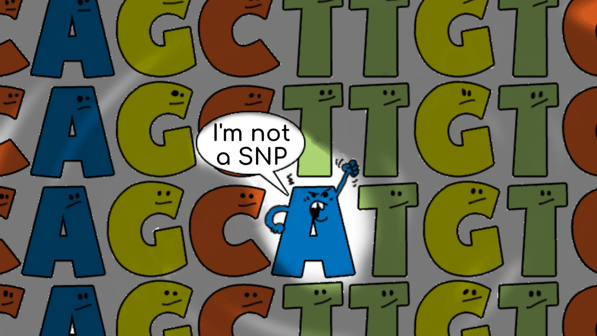

Call me by your reads
=====================

Crash course de llamado de variantes genómicas
----------------------------------------------

.. meta::
   :description lang=es: Curso de análisis de datos de secuenciación masiva para la identificación de variantes genómicas

Introducción
------------

A lo largo de las secuencias genómicas, los organismos de una misma especie pueden presentar variaciones que van desde un nucleótido hasta regiones cromosómicas complejas.

Los cambios pequeños que van desde 1 hasta 100 nucleótidos representan una fuente de variación entre organismos de una misma especie con la suficiente tolerancia para ocurrir con frecuencias elevadas (SNPs) y con los efectos suficientemente grandes para poder ser detectados como mecanismos causales de enfermedades o asociados a fenotipos específicos

El llamado de variantes genéticas a partir de datos de secuenciación masiva ha sido empleado primariamente en humanos con la finalidad de encontrar mecanismos de patogenicidad en enfermedades hereditarias, pero tambien ha sido empleado para análisis de variantes comunes asociadas a fenotipos específicos no deletéreos (GWAS).

Debido a su relación costo beneficio y a su amplia utilidad, este tipo de metodologías ha sido empleado en genotipifcación de otros organismos además del humano:
	* En `virus`_ como el virus de inmunodeficiencia humana se pueden detectar variantes asociadas a la resistencia a tratamiento antiretroviral
	* En `microorganismos`_ patógenos se puede realizar la detección de variantes asociadas a resistencia a antibióticos
	* En `animales`_ se puede realizar la detección de variantes para estudios de conservacion y de mejoramiento de razas (como en ganado y en crianza de perritos)
	* En `plantas`_ se puede realizar la genotipificación de variedades específicas para selección y mejoramiento de cultivos (como en trigo, maíz, chile y frijol)

El procedimiento general consiste en:
	0. Un experimento de secuenciación
		* Puede ser secuenciación de genoma completo
		* Puede ser secuenciación de regiones específicas
		* Puede ser secuenciación de regiones aleatorias

		.. image:: GBS.png
	1. Alineamiento de las lecturas a un genoma de referencia
		* `...`_ ó no
	2. Llamado de variantes
		* Pueden llamarse variantes por individuo
		* Pueden llamarse variantes por conjunto de individuos
	3. Genotipificación y faseo de los alelos
		* Construcción de haplotipos basado en secuenciación (usando *long reads*)
		* Construcción de haplotipos basado en relaciones interindividuales (usando árboles genealógicos)

		.. image:: data_flow.png

En este curso aprenderás a usar comandos básicos de linux y `GATK4`_ para el llamado de variantes genómicas a partir de datos de secuenciación masiva obtenidos de muestras humanas por individuo
	* La documentación de todo el curso estará disponible conforme avance el curso en `readthedocs.org`_
	* Mándanos tus preguntas, comentarios, sugerencias y quejas a nuestro canal en `discord`_

:doc:`Linux </linux>`
=====================
.. include:: linux.rst

:doc:`Parseando </parsing>`
===========================
.. include:: parsing.rst

:doc:`Conda </conda>`
=====================
.. include:: conda.rst

:doc:`NGS </ngs>`
=================
.. include:: ngs.rst

:doc:`BWA </bwa>`
=================
.. include:: bwa.rst

:doc:`GATK </gatk>`
===================
.. include:: gatk.rst

:doc:`snpEff </snpeff>`
=======================
.. include:: snpeff.rst

Contacto
--------
	Este curso fue llevado a ti por `ATGenomics`_, una iniciativa dedicada a la divulgación, promoción y capacitación en bioinformática
		* `@dianolasa`_
		* `@zorbax`_
		* `@vflorelo`_

.. _ATGenomics: https://atgenomics.com
.. _@dianolasa: https://twitter.com/dianolasa
.. _@zorbax:    https://twitter.com/zorbax
.. _@vflorelo:  https://twitter.com/vflorelo
.. _virus: https://pubmed.ncbi.nlm.nih.gov/29618499/
.. _microorganismos: https://pubmed.ncbi.nlm.nih.gov/30895217/
.. _animales: https://pubmed.ncbi.nlm.nih.gov/31541577/
.. _plantas: https://pubmed.ncbi.nlm.nih.gov/32814806/
.. _...: https://pubmed.ncbi.nlm.nih.gov/25056481/
.. _GATK4: https://gatk.broadinstitute.org/
.. _readthedocs.org: https://call-me-by-your-reads.readthedocs.io/en/latest/
.. _discord: https://discord.com/channels/724665563212939285/798223051253874709
